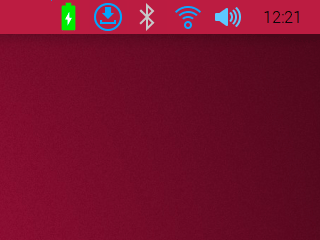

# INA219 Battery status

Battery status for the INA219 sensor on I2C with the native Linux Raspberry Pi OS, standing in the system tray, written with python3 and python3-pyqt5.



## Features (Copy paste & adapted from crowPi-L developments)

- Running on the native Linux Raspberry Pi OS,
- standing in the system tray,
- 7 state icons of the battery from 0% to 100%,
- icon when charging,
- alert icon when battery is very low,
- tooltip to view the percentage of the battery load and its voltage,
- contextual menu to properly quit the app,
- based on the official python script delivered by CrowPi (`/usr/local/sbin/getPowerBattery.py`),
- multi-threaded app to access the battery data with I2C.

## Requirements

- an INA219 connected via I2C
- [Pi-Apps](https://pi-apps.io/install/) and [Autostar](https://pi-apps.io/install-app/install-autostar-on-raspberry-pi/)

## Installing and starting the application

From a terminal, install python3-pyqt5

```
$ sudo apt install python3-pyqt5
```

From a terminal, clone this projet (the first time only), go to its directory, make it executable (the first time only), run it and enjoy!

### To test
```bash
git clone https://github.com/cyberpunk042/pios-ina219-batterystatus.git
cd pios-ina219-batterystatus/
chmod +x ./batteryStatus.py
./batteryStatus.py
```

### To install

```bash
git clone https://github.com/cyberpunk042/pios-ina219-batterystatus.git
cd pios-ina219-batterystatus/
sudo python install.py <user>
```
Then reboot
